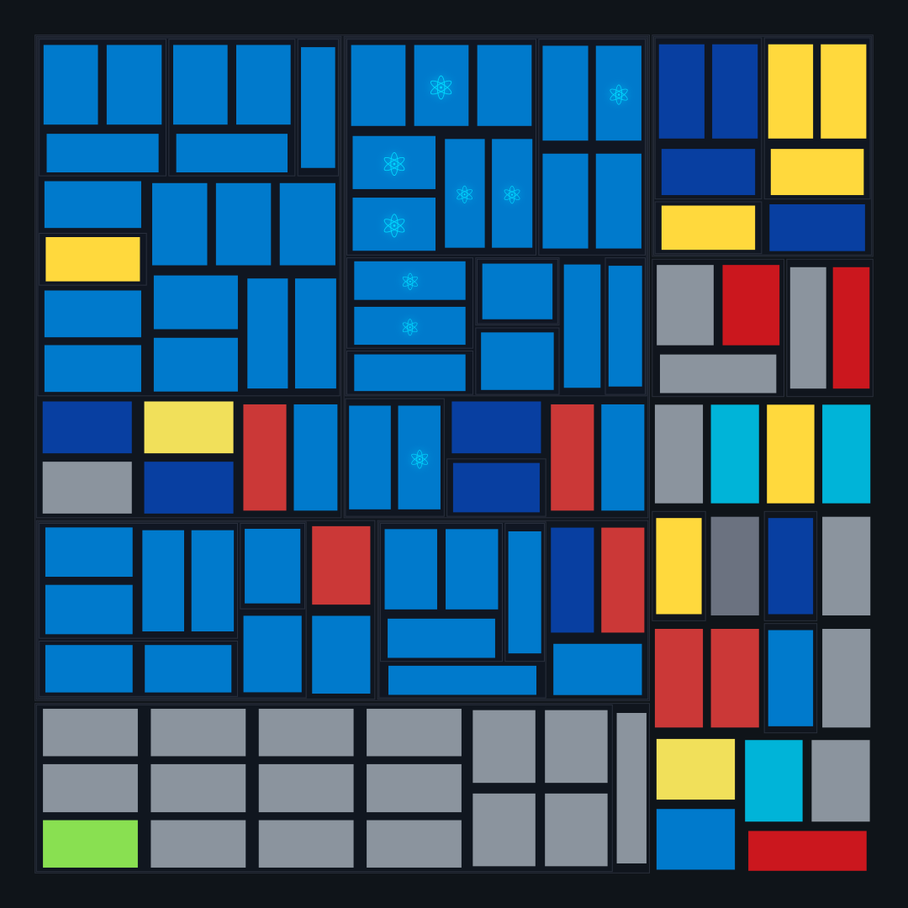
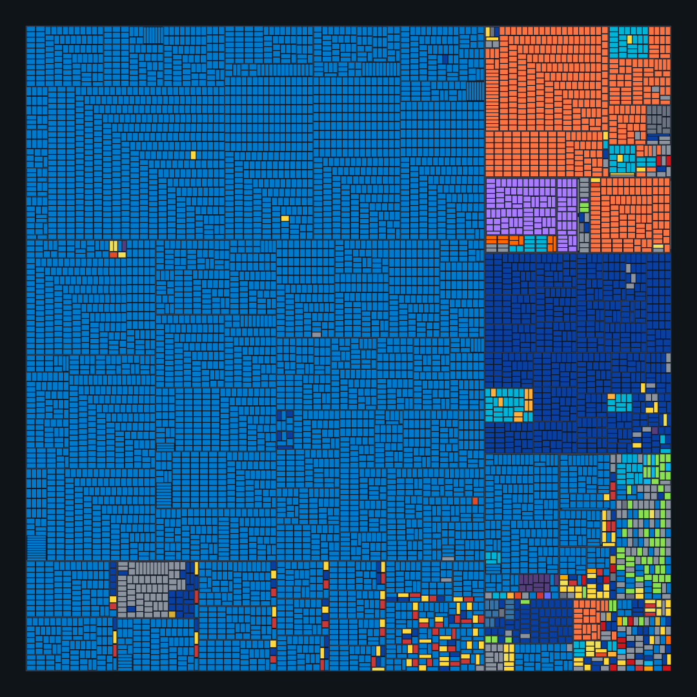

# File City

Visualize your codebase as a city. Files become buildings, directories become districts.

<!-- TODO: Add video here -->

<p align="center">
  
  
</p>

## Features

### 2D Architecture Map

A canvas-based top-down view of your codebase with:

- **Treemap layout** - Directories and files sized by content
- **Highlight layers** - Color-code files by type, status, or custom rules
- **Interactive** - Pan, zoom, click to navigate
- **Directory abstraction** - Auto-collapse small directories when zoomed out
- **File type icons** - Visual indicators for different file types

### 3D City View

A full 3D visualization using React Three Fiber:

- **Buildings as files** - Height represents file size/complexity
- **Animated transitions** - Smooth grow animations from 2D to 3D
- **Orbit controls** - Rotate, pan, and zoom the city
- **Highlight layers** - Isolate, dim, or hide non-highlighted files
- **Configurable** - Adjust colors, heights, animations

## Installation

```bash
npm install @principal-ai/file-city-builder @principal-ai/file-city-react
```

## Quick Start

### Build city data from a file tree

```typescript
import { CodeCityBuilderWithGrid } from '@principal-ai/file-city-builder';

const builder = new CodeCityBuilderWithGrid();
const cityData = builder.buildCityFromFileSystem(fileTree);
```

### Render as 2D map

```tsx
import { ArchitectureMapHighlightLayers } from '@principal-ai/file-city-react';

<ArchitectureMapHighlightLayers
  cityData={cityData}
  enableZoom={true}
  showFileNames={true}
  onFileClick={(path, type) => console.log('Clicked:', path)}
/>
```

### Render as 3D city

```tsx
import { FileCity3D } from '@principal-ai/file-city-react';

<FileCity3D
  cityData={cityData}
  animation={{ startFlat: true, autoStartDelay: 500 }}
  onBuildingClick={(building) => console.log('Clicked:', building.path)}
/>
```

### Highlight specific files

```tsx
const layers = [
  {
    id: 'tests',
    name: 'Test Files',
    enabled: true,
    color: '#22c55e',
    items: cityData.buildings
      .filter(b => b.path.includes('.test.'))
      .map(b => ({ path: b.path, type: 'file' })),
  },
];

<FileCity3D
  cityData={cityData}
  highlightLayers={layers}
  isolationMode="transparent"
/>
```

## Packages

| Package | Description |
|---------|-------------|
| [@principal-ai/file-city-builder](./packages/builder) | Core algorithms for generating city layouts |
| [@principal-ai/file-city-react](./packages/react) | React components for 2D and 3D visualization |
| [@principal-ai/file-city-server](./packages/server) | Server-side rendering utilities |
| [@principal-ai/file-city-cli](./packages/cli) | CLI tools for tours and validation |

## License

MIT
